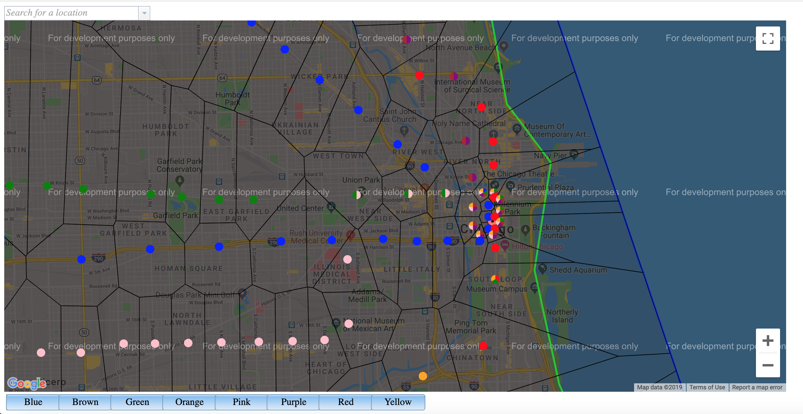

CTA Voronoi
===========

Generates Voronoi diagrams based on CTA station locations.

First, run `npm install`

If you have a Google Maps API key, put it into `src/amd/gmaps-api.key`.

Next, run `npm run build`.

Finally, run `npm run start`.

## What it looks like

Here's a screenshot of what you can expect to see:

